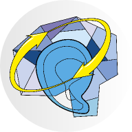

title: CAL Symposium 2017

# Closing the Auditory (efferent) Loop II

{.left}

{style="width:33%; float:left; margin-right:3em;"}

## MAY 10th - 12th 2017 in Krems, Austria

 

### About

In the future of hearing aids and implants, which actually help deaf new-borns as well as the aging society, Brain Computer Interfaces will once be needed to make a last big leap to full hearing restoration. It will achieve, in a nutshell, the revived cocktail party capability. However this may take us 10 to 15 years from now. While both academia and industry are convinced that such solutions will truly appear, many currently refrain from entering this transdisciplinary, long and unknown field of research and development.

Similar to last centuries’ computer chip development, a road mapping action can pave such a way. It will define challenges, critical experiments and milestones on a pre-competitive basis. New research collaborations as well as joint funding programs are initiated.

As we come from existing clinical practice, we reflect mature hearing aids or restauration systems and pursue precisely defined objectives. Thus our activity can be seen distinct from other BCI road mapping activities of more general and philosophical nature.

<!-- {.img-rounded} -->

### Aims and Execution

The accomplishment of the symposium will bring us closer in achieving two main goals:

-   define a **Roadmap**: 
    -   bring together experts, share knowledge, define critical experiments etc.

-   assemble a **Consortium** composed of research and industry for future projects: 
    -   within Germany: transregional SFB
    -   within EU: Horizon 2020 
    -   worldwide: MSCA action, EU-project with external partners

To reach these goals there will be plenary talks giving an overview into 5 main topics, expert talks giving 
us an insight into current research already leading into the direction of closing the loop. Finally, a workshop 
will give us the chance to discuss important questions initiated by the talks and of course during coffee breaks. 
We will define the most challenging questions that need to be answered to go the next step and set milestones for the 
next 10 years.  
Besides known experts in their fields we will include young researchers, industrial partners as well as delegates from 
culture and politics.

-------------------

Contact Information
-------------------

> Biomaterial Engineering
> HNO-Klinik
> Medizinische Hochschule Hannover
> Stadtfelddamm 34
> 30625 Hannover
> [biomaterialengineering@mh-hannover.de](mailto:biomaterialengineering@mh-hannover.de)

------------------------
### Organizing Committee

<!--
- Marlies Knipper, Department for Molecular Physiology of Hearing, Hearing Research Centre Tübingen, Germany
- Stefan Debener, Department for Neuropsychology, University Oldenburg, Germany
- Theodor Doll, BioMaterial Engineering, Medical School Hannover, Germany
- Maria Höfer, BioMaterial Engineering, Medical School Hannover, Germany
- Thomas Lenarz, ENT Department, Medical School Hannover, Germany
-->

----------------------------
### With the kind support of

{.img-rounded}

