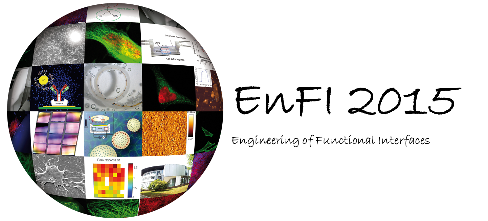

title: EnFI 2015 Conference

Engineering of functional Interfaces
====================================



We are looking forward to receiving your abstracts until April 12th.
---

Modern medicine, engineering and information technology have one fact in common: They all rely on materials interfaces that provide additional functionalities. This holds not only for ceramic hip joints but equally well for biochemical sensors in bioreactors or nanoelectronic processors - just to name a few examples. However, each scientific discipline has its own sight on these interfaces, emphasizes one property more than others and, not at last, its own scientific language and theoretical models. For young scientists who are working in these interdisciplinary, overlapping fields such as active prostheses, biochemical sensors or brain-computer interfaces this “Babylonic language confusion” is an extra burden to overcome.

The EnFI conference series has exactly this point in mind. EnFI serves with an exchange of perspectives where young researchers present their work in short oral presentations in the   elds of sensors, medical implants, biocatalysis as well as technology and surface analytics. This way, they become familiar with a broad range of concepts, experimental methodologies and theoretical models. Ample time is reserved for the discussions at the posters markets, which will be stimulated by a competition for prestigious awards. As a framework for this, also carefully selected and internationally renowned speakers will deliver keynote lectures as solid introductions to their fields.

The Hannover Medical School, in cooperation with Leibniz University and the Veterinary School are proud to host EnFI in2015, which is now running already in its 8th consecutive year.
 
The organizers invite you for this interdisciplinary exchange of ideas amongst PhD students and post-doctoral researchers aside of the established conferences. Furthermore, EnFI is a workshop of excellence, as routinely more than 35% of the contributions result directly in peer-reviewed journal publications. Moreover, the conference series has always rewarding elements which make EnFI a memorable event for all participants. Hannover will continue this tradition with both an excellent selection of contributions and tutorials as well as a lively city to experience with its historic sites, leisure places and exciting social events.

We are looking forward to receive your contribution and welcome you as our guests!

[EnFI-Flyer](03_enfi-2015/enfi2015flyer.pdf)  

---
**Topical Sessions**   


* Bio/Chemical Sensors   
* Interfaces to Life Science and Medicine   
* Engineering on the Micro- and Nanoscale   
* Functional Organics: Surfaces and Molecules   
* Inorganic Films and Devices   

---


Contact Information
-------

```
Biomaterial Engineering
HNO-Klinik
Medizinische Hochschule Hannover
Feodor-Lynen-Straße 27
30625 Hannover
enfi-2015@mh-hannover.de

Bettina Goede
Tel: +49 (0)511 532 7231
```

--------------------------------------------------------
**With the kind support of:**


[![Logo HNO Förderverein][1]][2]
[1]: 03_enfi-2015/logofoerderverein.png
[2]: https://www.mh-hannover.de/27918.html

[![Logo BlackRock Microsystems][3]][4]
[3]: 03_enfi-2015/BRMELogoklein.jpg
[4]: http://www.blackrockmicro.com/