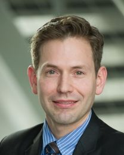

title: Tutorial Session A
status: draft

Nanoscale characterization of tribological surfaces
===================================================
Although not well recognized, friction and wear phenomena are omnipresent in our society and affect many processes 
that range from transportation to data storage, health and cosmetics. To understand these phenomena it is important to 
realize that sliding surfaces in dry or lubricated conditions undergo significant changes in terms of topography, 
chemistry and microstructure and a nanoscale so-called “third body” [1] develops. The third-body formation strongly 
influences the frictional and wear behavior of the system. In this tutorial presentation I will introduce general 
tribological concepts and will present novel in-situ tools, modern surface analytical techniques and simulations. 
Finally I will present case studies to illustrate how to combine these results in order to understandi underlying 
basic mechanisms.  
[1]	M. Godet, Wear, 100 (1984) 437–452.

Prof. Dr. M. Dienwiebel
---

Martin Dienwiebel studied Physics in Dortmund and Bonn, Germany and conducted his Master thesis research in the field 
of low temperature STM at the National Research Center Juelich. He obtained his PhD in the field of friction force 
microscopy and Superlubricity at Leiden University, The Netherlands. During his PhD research he also spent nine months 
at Tokyo Institute of Technology in the group of Prof. Takayanagi.

After his PhD in 2003 he worked in automotive industry at the tribology research department of IAVF Antriebstechnik AG 
company. In 2008 he received an Emmy-Noether fellowship from the German Research Foundation and set up a junior research 
group at Karlsruhe Institute of Technology and the Fraunhofer Institute for mechanics of Materials. He obtained his 
habilitation 2011 at the Mechanical Engineering faculty of KIT. 
