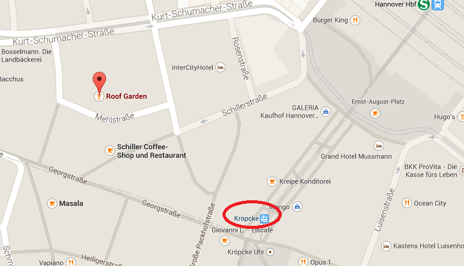

title:Route Description
status: draft

##Conference Locatation
---

http://mhh-kongressexpose.de/onewebstatic/13a84328e2-DSCF1485.jpg

Forum Niedersachsen
Feodor-Lynen-Straße 27
30625 Hannover

The conference will take place in the Medical Park in Hannover in close vicinity to the Medical School. The location in the Forum Niedersachsen includes the auditorium, Poster session and lunch/coffee break location.

It is in walking distance from the [Ibis Hotel](/Hotels/) and not very far from the [GHotel](/Hotels/).

**By Bus/Tram**: The closest stop is "Neue Landstraße". You can take busses 123 or 137 to get there. You can find information on time tables on the [Üstra Homepage](http://www.uestra.de/). Depending on were you are, trams 3,4,7,9 cross the bus routes.
**TIP:** The Hotels and conference location are in *Ticket Zone 1*. If you are uncertain which ticket to buy, just enter your destination.

**By Train:** Got to the ground level of train station.Take the northbound subway 3/7/9 to "Spannhagengarten" (take bus 137 from there) or to "Noltemeyerbrücke" (take bus 123 from there).Take the bus to go to "Neue Landstraße". You can find information on time tables on the [Üstra Homepage](http://www.uestra.de/)

**By Car:** From either A7 or A2 you can take the B3 (Messeschnellweg). Get off at the Weidetorkreisel and drive toward Hannover Medical School (MHH). Take a right turn into the Rudolph-Pichlmayer-Straße. The Forum Niedersachsen is directly in front of you at the end of the street. Please park your car in one of the listet locations to avoid a parking ticket or beeing towed away.

##Conference Dinner
---
The Dinner will take place at the [Roof Garden](www.roof-garden.de). Enjoy!

**Transport info:**
We provide tickets for the busses and trams to get to the conference location and back home. You can join us at 19:30 at the tram station Misburger Straße to go to the Dinner location together.

**If you don't want to participate in the generell tranfer:**

Address: Roof Garden, Mehlstraße 2, Hannover
Parking:
[Tram/Bus](www.üstra.de):

* from Ibis Hotel: Take the bus 123/137 to Misburger Straße; from there take the Tram 4 to Kröpcke.
* from GHotel: take the 137 to Kantplatz; from there take tram 4/5 to Kröpcke
* from conference location: take the bus 123 to Noltemeyerbrücke or 137 to Spannhagengarten; from there take tram 3/7/9 to Kröpcke.

Kröpke is an U-Bahn station. Leave it towards Georgstraße.

##Sunday Get Together
---
Since a few confernce participants will already arrive on sunday, there is a get together in a beer garden for everybody who would like to get to know the other participants, who would like to revive old aquaintances or who would just like to have a cold beer after a long day of travelling.

The location is the [Waterloo Biergarten](http://www.waterloo-biergarten.de/) near the Hanover City Center. If you have time beforehand to get to know the city you can for example end your walk along the [Red Line](http://www.roterfaden-hannover.de/) here. It is quite close.

How to get [there](www.üstra.de):
* from Ibis Hotel: Take the bus 123/137 to Misburger Straße; from there take the Tram 4 to Kröpcke. From here it is easiest to walk.
* from GHotel: take the 137 to Kantplatz; from there take tram 4/5 to Kröpcke. From here it is easiest to walk.
* from conference location: take the bus 123 to Noltemeyerbrücke or 137 to Spannhagengarten; from there take tram 3/7/9 to Markthalle/Landtag or Waterloo.

