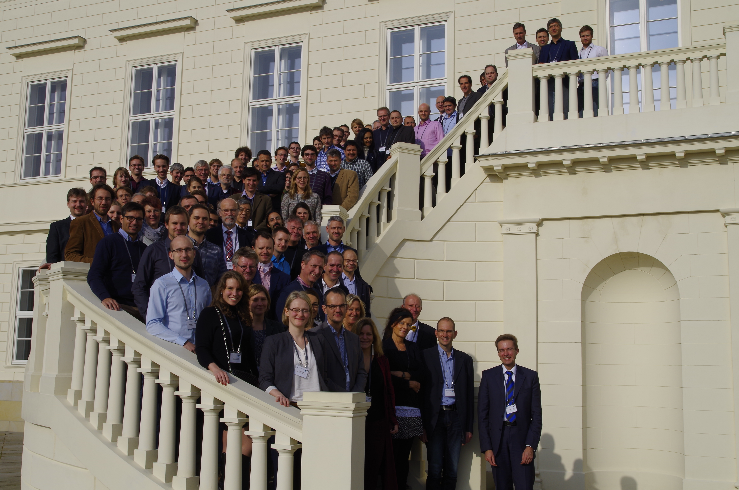

title: CAL Symposium 2015

# Closing the Auditory Loop 

{style="width:27%"}

 

## Thank you to all participants for their contributions!
{.img-rounded}

### About

In the future of hearing aids and implants, which actually help deaf new-borns as well as the aging society, Brain Computer Interfaces will once be needed to make a last big leap to full hearing restoration. It will achieve, in a nutshell, the revived cocktail party capability. However this may take us 10 to 15 years from now. While both academia and industry are convinced that such solutions will truly appear, many currently refrain from entering this transdisciplinary, long and unknown field of research and development.

Similar to last centuries’ computer chip development, a road mapping action can pave such a way. It will define challenges, critical experiments and milestones on a pre-competitive basis. New research collaborations as well as joint funding programs are initiated.

As we come from existing clinical practice, we reflect mature hearing aids or restauration systems and pursue precisely defined objectives. Thus our activity can be seen distinct from other BCI road mapping activities of more general and philosophical nature.

The symposium is sponsored by the German Volkswagen Foundation and will be held in the famous Herrenhausen castle within a rewarding framework.

{.img-rounded}

### Aims and Execution

The accomplishment of the symposium will bring us closer in achieving two main goals:

-   define a **Roadmap**: 
    -   bring together experts, share knowledge, define critical experiments etc.

-   assemble a **Consortium** composed of research and industry for future projects: 
    -   within Germany: transregional SFB
    -   within EU: Horizon 2020 
        1.   Coordination and Support Action Spring 2016 
        2.   meet again in Krems in summer 2016 and finalize grant proposal
        3.   EU grant in autumn 2016 as a consortium
    -   worldwide: MSCA action, EU-project with external partners

To reach these goals there will be plenary talks giving an overview into 5 main topics, expert talks giving us an insight into current research already leading into the direction of closing the loop. Finally, a workshop will give us the chance to discuss important questions initiated by the talks and of course during coffee breaks. We will define the most challenging questions that need to be answered to go the next step and set milestones for the next 10 years.  
Besides known experts in their fields we will include young researchers, industrial partners as well as delegates from culture and politics.

### Results

An abstract booklet including the abstracts for all talks and posters, as well as the program and a list of participants is available for [download](/__downloads/abstractbooklet_cal_2015.pdf).

The program consist of:

- plenary lectures summarizing the state of the art in certain topics
- expert talks giving a more specific insight into selected research areas
- a workshop to discuss and define the roadmap.

For detailled information about the results of the Symposium, please contact Maria Hoefer:
[hoefer.maria@mh-hannover.de](mailto:hoefer.maria@mh-hannover.de)

-------------------

Contact Information
-------------------

> Biomaterial Engineering
> HNO-Klinik
> Medizinische Hochschule Hannover
> Feodor-Lynen-Straße 27
> 30625 Hannover
> [hoefer.maria@mh-hannover.de](mailto:hoefer.maria@mh-hannover.de)
> 
> Maria Hoefer
> Tel: +49 (0)511 532 7235

------------------------
### Organizing Committee

- Marlies Knipper, Department for Molecular Physiology of Hearing, Hearing Research Centre Tübingen, Germany
- Stefan Debener, Department for Neuropsychology, University Oldenburg, Germany
- Theodor Doll, BioMaterial Engineering, Medical School Hannover, Germany
- Maria Höfer, BioMaterial Engineering, Medical School Hannover, Germany
- Thomas Lenarz, ENT Department, Medical School Hannover, Germany

----------------------------
### With the kind support of

{.img-rounded}
