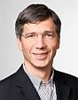

title: Speakers
status: hidden

## Speakers

short introducing text

[Plenary talks](#plenary-talks) (overview), Expert talks (research), workshop leadears (group leaders during workshop on day 3)

Names of all Speakers in alphabetic order: Pascal Barone, Alexandra Bendixen, Alain De Cheveigne, Paul Hinckley Delano, Werner Hemmert, Preben Kidmose, Marlies Knipper, Bernhard Laback, Thomas Lenarz, Annette Limbergerm, Enrique Lopez-Poveda, Myles McLaughlin, Ray Meddis, Jean-Luc Puel, Sonja Pyott, Helge Rask-Anderson, Manuel Sánchez-Malmierca, Marc Schönwiesner, Anneliese Schrott-Fischer, Anu Sharma, Georg Sprinzl, Thomas Stieglitz, Michael Tangermann, Pim van Dijk, Hans-Peter Zenner

### Plenary Talks

<!--  -->


{class=align-left}

```

Werner Hemmert
TU München, Germany
Title of Talk

```


```

Marlies Knipper
UK Tübingen, Germany
Title of Talk

```
<br style="clear: both;">


```

Thomas Lenarz
ENT Department, Medical School Hannover, Germany
Title of Talk

```
<br style="clear: both;">


```

Annette Limberger
University Aalen, Germany
Title of Talk

```
<br style="clear: both;">


```

Ray Meddis
University of Essex, UK
Title of Talk

```
<br style="clear: both;">


```

Jean-Luc Puel
Institute for Neuroscience, Montpellier, France
Title of Talk

```
<br style="clear: both;">


```

Helge Rask-Anderson
ENT Department, University Hospital Uppsala, Sweden
Title of Talk

```
<br style="clear: both;">


```

Manuel Sánchez-Malmierca
, University of Salamanca, Spain
Title of Talk

```
<br style="clear: both;">


```

Anneliese Schrott-Fischer
ENT Department, UK Innsbruck, Austria
Title of Talk

```
<br style="clear: both;">


```

Hans-Peter Zenner
ENT Department, UK Tübingen, Germany
Title of Talk

```
<br style="clear: both;">

----------------
### Expert Talks


```

Pascal Barone
Centre de Recherche Cerveau et Cognition, Toulouse, France
Title of Talk

```
<br style="clear: both;">


```

Alexandra Bendixen
University Chemnitz, Germany
Title of Talk

```
<br style="clear: both;">


```

Alain De Cheveigne
Laboratoire Psychologie de la Perception, Paris, France
Title of Talk

```
<br style="clear: both;">


```

Paul Hinckley Delano
Universidad de Chile, Chile
Title of Talk

```
<br style="clear: both;">


```

Preben Kidmose
Århus University, Denmark
Title of Talk

```
<br style="clear: both;">


```

Bernhard Laback
Acoustic Research Institute, Vienna, Austria
Title of Talk

```
<br style="clear: both;">


```

Enrique Lopez-Poveda
University of Salamanca, Spain
Title of Talk

```
<br style="clear: both;">


```

Myles McLaughlin
KU Leuven, Belgium
Title of Talk

```
<br style="clear: both;">


```

Sonja Pyott
UMC Groningen, Netherlands
Title of Talk

```
<br style="clear: both;">


```

Marc Schönwiesner
Université de Montréal, Canada
Title of Talk

```
<br style="clear: both;">


```

Anu Sharma
University of Colorado at Boulder, USA
Title of Talk

```
<br style="clear: both;">


```

Georg Sprinzl
ENT department, UK St. Pölten, Austria
Title of Talk

```
<br style="clear: both;">


```

Thomas Stieglitz
University Freiburg, Germany
Title of Talk

```
<br style="clear: both;">


```

Michael Tangermann
Brain State Decoding Lab, Freiburg, Germany
Title of Talk

```
<br style="clear: both;">


```

Pim van Dijk
ENT Department, UMC Groningen, Netherlands
Title of Talk

```
<br style="clear: both;">

-------------------
### Workshop leader


```

Susan Denham
Cognition Institute, Plymouth, UK
Workshop

```
<br style="clear: both;">


```

Maarten De Vos
Institute of Biomedical Engineering, Oxford, UK
Workshop

```
<br style="clear: both;">


```

Barbara Shinn-Cunningham
Boston University, USA
Workshop

```
<br style="clear: both;">


```

Jérémie Voix
École de Technologie Supérieure, Montreal, Canada
Workshop

```
<br style="clear: both;">


```

Florian Solzbacher
Company, Germany
Workshop

```
<br style="clear: both;">


```

Bernd Waldmann
Cochlear, Germany
Workshop

```
<br style="clear: both;">


```

Ralph Holme
Company, Germany
Workshop

```
<br style="clear: both;">

