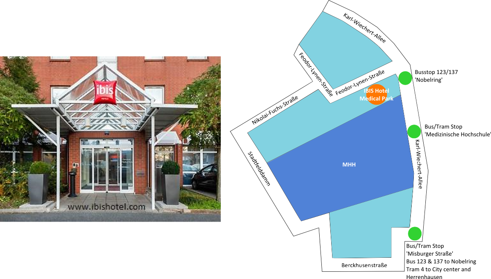
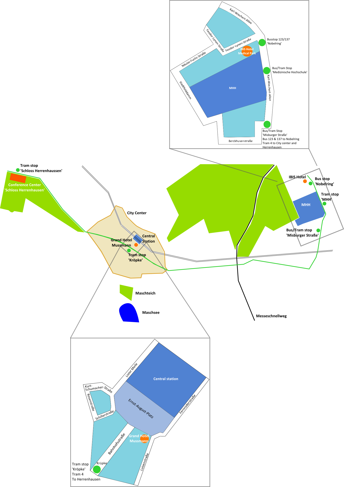

title: Travel
status: hidden

## Hotels

We have booked single rooms for you. Once you register you will get a confirmation containing information in which of the two hotels you are going to stay. 

------------------------
### Grand Hotel Mussmann

The Grand Hotel Mussmannn is located at the center of Hannover right across the main station and only a 3 min walk from the tram station called 'Kröpcke'. Here you can take *tram no. 4* towards 'Garbsen'. This will bring you directly to the Conference Center Schloss Herrenhausen. It is only a 7 min train ride. Of course, we will provide tickets for public transfer.

{.img-rounded } 

Ernst August Platz 7   
30159 Hannover   

Tel: +49(0)511 36 56 0    
Fax: +49(0)511 36 56 145    
Mail: [Grandhotel@Hannover.de](mailto:Grandhotel@Hannover.de)
 
[www.grandhotel.de](www.grandhotel.de)

--------------------------------------
### IBIS Hotel Hannover - Medical Park

The IBIS Hotel  is located at Medical Park Hannover right next to the Medical School Hannover. To get to the Conference Center Schloss Herrenhausen you have two options. You can either go to the bus station 'Nobelring' almost in front of the hotel, take one of the *buses (123, 137)*, change at the bus/tram station 'Misburger Straße' to *tram No. 4* towards 'Garbsen'. The other option is to walk to the tram station 'Medizinische Hochschule' where you can directly take *tram no. 4* towards 'Garbsen'. *Tram no. 4* will bring you directly to the Conference Center Schloss Herrenhausen. It is only a 22 min tram ride. Of course, we will provide tickets for public transfer.

{.img-rounded}

Feodor-Lynen-Straße 1   
30625 Hannover   

Tel: +49(0)511 95 67 0   
Fax: +49(0)511 95 67 140   
Mail: [H1632@accor.com](mailto:H1632@accor.com)

[www.ibishotel.com](www.ibishotel.com)   
[www.accorhotels.com](www.accorhotels.com)

-----------------
### How to get to the Conference Center

This is a sketch of the city Hannover. Highlighted are the Conference Center, the hotels, the city center, the MHH and public transfer. You can see where about the hotels and the conference center are located within the city.

{.img-rounded}

