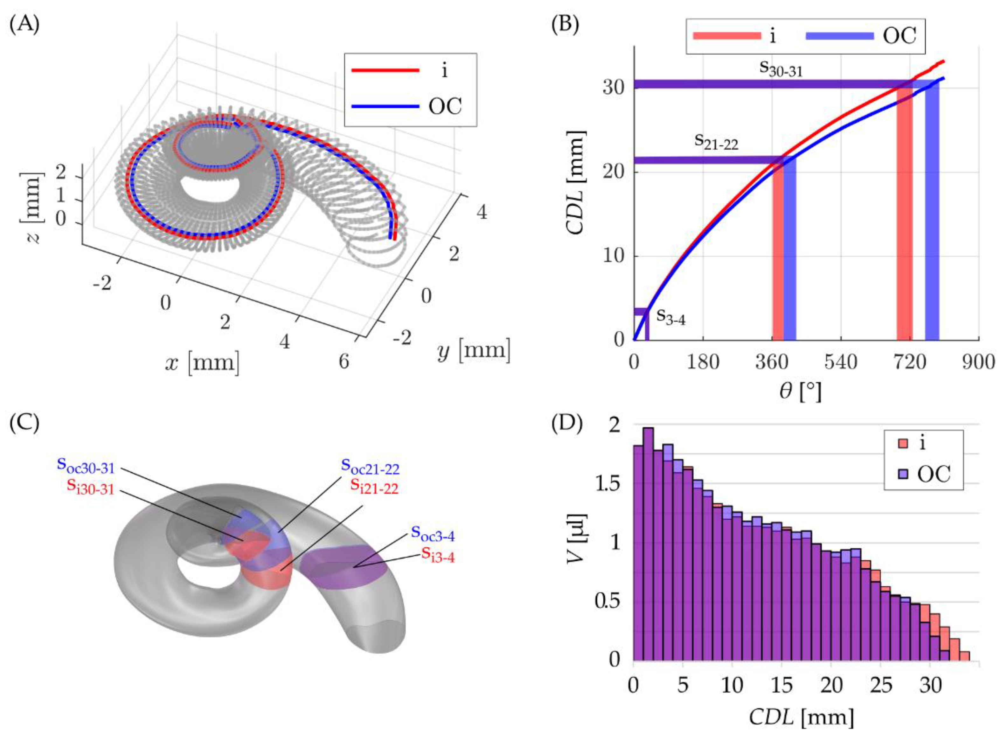

title: Artificial Cochlea Models (ACMs)
status: hidden

Dear Visitors,

Thanks for your interest in our models. Below you can find links to additional files as well as further information about the models we have published.

Feel free to use the data or to contact the authors if interested. In case you used the provided data, please cite the mentioned paper where applicable.

# Anatomic realistic human scala tympani mean model

The anatomically realistic human ST mean model and the corresponding insertion phantom, as described in Fröhlich _et al._ (2024), are readily accessible below. The methods for generating and manufacturing the models, as well as the anatomical parameters are described in the manuscript and its accompanying appendices.

Please cite as: Fröhlich M, Schurzig D, Rau TS, Lenarz T (2024): On the interdependence of insertion forces, insertion speed, and lubrication: Aspects to consider when testing cochlear implant electrodes. PLOS ONE. [doi](https://doi.org/10.1371/journal.pone.0295121)

|    |    |
| -- | -- |
|   |    |
|  **Figure 1: Scala Tympani (ST) Mean Model Generation.** Generation of the ST model follows several steps to preserve the common anatomical features of the cross-sectional geometry [Schurzig _et al._, 2021], as this defines the contact area between electrode and phantom. Cross sections can vary in size and orientation between individuals (a,b) and were rotated to the cochlear angle dependent average orientation of the basilar membrane (c). Then manual segmentations points were redistributed evenly and consistent for all cross sections of the n= 15 datasets and datapoints were averaged at the respective angular location (d).  |  **Figure 2: Mean ST Insertion Phantom.** For the orientation of the ST model (a) the cochlear coordinate system (CCS, Verbist et al., 2010) is adopted with the y-axis being the insertion axis. The model is transferred to the physical insertion phantom (b) and an idealized cochlea opening is created. The transformation is described in detail in Appendix S1 of the accompanying publication.  |

# Uncoiled human scala tympani

Supplemental digital material for the uncoiled human scala tympani, as desribed in Schurzig _et al._ (2021). Please find below links to ZIP-files containing the two models (as STEP-files) mentioned in the paper. 

[Link to i-path model](01_workgroups/cas/methods/cochlearmodelling/uncoiled_st_ipath.zip) and [Link to oc-path model](01_workgroups/cas/methods/cochlearmodelling/uncoiled_st_ocpath.zip)

Please cite as: Schurzig D, Fröhlich M, Raggl S, Scheper V, Lenarz T, Rau TS (2021): Uncoiling the Human Cochlea—Physical Scala Tympani Models to Study Pharmacokinetics Inside the Inner Ear. Life 11:373. [doi](https://doi.org/10.3390/life11050373)

|    |    |
| -- | -- |
|   |   |
|  **Figure 1**: CAD (computer-aided design) model generation in SolidWorks: (**A**) spiral models were generated with the loft feature using cross-sectional information in 22.5° steps, whereas (**B**) straight models uncoiled along a specific trajectory (solid black line) were created based on cross-sectional information in 1 mm intervals along this trajectory.  |  **Figure 2**: (**A**) visualization of insertion (in red) and OC (in blue) paths inside the ST, (**B**) the length of these paths along the cochlear spiral including an exemplary visualization of three cochlear sections. (**C**) Visualization of these cochlear sections in the CAD model and (**D**) a depiction of all sectional volumes along the insertion and OC paths.  |

### References

Fröhlich M, Schurzig D, Rau TS, Lenarz T (2024): On the interdependence of insertion forces, insertion speed, and lubrication: Aspects to consider when testing cochlear implant electrodes. PLOS ONE. [doi](https://doi.org/10.1371/journal.pone.0295121)

Schurzig D, Fröhlich M, Raggl S, Scheper V, Lenarz T, Rau TS (2021): Uncoiling the Human Cochlea—Physical Scala Tympani Models to Study Pharmacokinetics Inside the Inner Ear. Life 11:373. [doi](https://doi.org/10.3390/life11050373)

Verbist BM, Skinner MW, Cohen LT, Leake PA, James C, Boëx C, Holden TA, Finley CC, Roland PS, Roland JT, Haller M, Patrick JF, Jolly CN, Faltys MA, Briaire JJ, Frijns JHM (2010): Consensus Panel on a Cochlear Coordinate System Applicable in Histologic, Physiologic, and Radiologic Studies of the Human Cochlea. Otology & Neurotology, 31(5), 722–730. [doi](https://doi.org/10.1097/MAO.0b013e3181d279e0)
