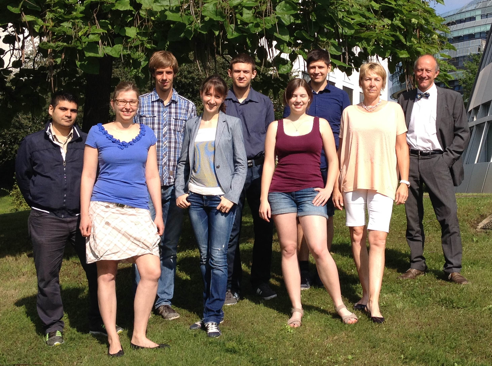

title: AG Doll - BioMaterial Engineering

**Head of research group**   														
							
 |  Prof. Dr.-Ing. Theodor Doll |  doll.theodor(at)mh-hannover.de	
														
----------------------------------------------------------------------------------------
**Team Assistant**																		

 | Bettina Goede					|		goede.bettina(at)mh-hannover.de	|	Phone: 0511 532 7231	|	Fax: 0511 532 18576 

---------------------------
**Research Team**

 | Dipl.-Ing. Pooyan Aliuos, PhD					|		alious.pooyan(at)mh-hannover.de

 | Dipl.-Ing. Jan Stieghorst					|		stieghorst.jan(at)mh-hannover.de

 | Katharina Tegtmeier, M.Sc.			|		tegtmeier.katharina(at)mh-hannover.de

-----------------------------
**Students**

 | Friederike Benjamin, B.Eng.				|		Benjamin.friederike(at)mh-hannover.de	| Master Thesis

 |	Alexandra Bondarenkova	|	bondarenkova.alexandra(at)mh-hannover.de	|	Bachelor Thesis

 | Felix Golly, B.Sc.	|	golly.felix(at)mh-hannover.de	|	HiWi

 | Janine McCaughey, B.Sc.				|		mccaughey.janine(at)mh-hannover.de	|	HiWi

 | Sven Meinen, B.Sc.	|	meinen.sven(at)mh-hannover.de	|	Master Thesis

 | Felix Riedel, B.Eng.	|	riedel.felix(at)mh-hannover.de	|	Master Thesis

 | Nina Sendler, B.Eng.	|	sendler.nina(at)mh-hannover.de	|	Master Thesis

 | Eugen Stockburger	|	stockburger.eugen(at)mh-hannover.de	|	Bachelor Thesis

-----------------------------
**Former Students and Researchers**

 |Dipl.-Ing. Malte Schickedanz		| Diploma Thesis	

